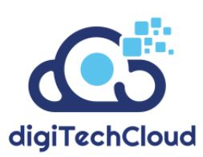

# Oracle-1Z0-1084-20 
### Comprehensive cheat sheet to pass Oracle 1Z0-1084-20 Exam

------

#### True in regards to service resiliency:
- Resiliency is about avoiding failures

#### Provisioning of storage buckets as part of your Kubernetes deployment process for the application:

- OCI Service Broker for Kubernetes

#### Find details of the tolerations field in a sample YAML file:
- kubectl explain pod.spec.tolerations

#### Load balancer shape is used by default in OCI container Engineer for Kubernetes:

- 100 Mbps

#### OCI Load Balancer integration with OCI Container Engine for Kubernetes (OKE):

- OKE service provisions a single OCI Load Balancer instance shared with all the Kubernetes services with LoadBalancer type in the YAML configuration

#### NOT a valid option to execute a function deployed on Oracle Functions:

- Invoke from Docker CLI

#### Wish to receive an email each time a Terraform action begins:

- Create an OCI Notification topic and email subscription with the destination email address. Then create an OCI Events rule matching "Resource Manager job - Create" condition, and select the notification topic for the corresponding action

#### Appropriate logging approach:

- All services log to standard output only

#### Service aggregator pattern:

- It involves implementing a separate service that makes multiple calls to other backend services

#### Which language cannot be used to write your Oracle function code:

- PL7SQL

#### NOT a supported SDK for Oracle Cloud Infrastructure:

- .NET SDK

#### Testing approaches for achieving high velocity of deployments and release of cloud-native applications:

- Automated testing

#### Per CAP theorem, the scenario where you need to make any trade-off between the guarantees:

- when there are no network partitions

#### Provide a log file from one of the nodes for troubleshooting purpose:

- ssh into the nodes using private key

#### Incorrect statement regards to the Oracle Cloud Infrastructure (OCI) Notifications service:

- It may be used to receive an email each time an OCI Autonomous Database backup is completed

#### Differences between a microservice and a serverless function:

- Microservices are used for long running operations and serverless functions for short running operations.

#### Rule can you use to prevent a container from running as root using PSP:

- MustRunAsNonRoot

#### Default locations of the configuration file that Oracle Cloud Infrastructures CLI uses for profile information:

- SHOME/.oci/config

#### API should you use to read and process the stream in OCI Streaming service:

- GetMessages

#### Use Oracle Cloud Infrastructure (OCI) APIs to POST messages to a stream in the OCI Streaming service:

- The request must include an authorization signing string including (but not limited to) x-contentsha256,content-type, and content-length headers

#### Minimum of storage that a persistent volume claim can obtain in OCI Container Engine for Kubernetes:

- 50 GB

#### NOT related to Oracle Cloud Infrastructure Resource Manager:

- Queue

#### Policies to control access not available in OCI API Gateway:

- Controlling access to OCI resources

#### open source engine for Oracle Functions:

- Fn Project

#### NOT required when signing GET requests to Oracle Cloud Infrastructure APIs:

- content-type

#### Trigger Oracle functions directly from other OCI services, without having to run custom code:

- OCI Registry

#### OCI service you can use to create and manage your infrastructure:

- OCI Resource Manager

#### Execute a script on a remote instance through OCI Resource Manager:

- Use Remote-exec

#### Dynamically make Kubernetes resources discoverable to public DNS servers:

- ExteralDNS

#### Delete container image from the  repository:

- Edit the tenancy global retention policy

#### Authenticate with OCI CLI:

- Run oci session authenticate and provide your credentials

#### NOT a valid backend-type supported by Oracle Cloud Infrastructure (OCI) API Gateway:

- ORACLE_STREAMS_BACKEND

#### Difference between blue/green and canary deployment strategies:

- In blue/green, both old and new applications are in production at the same time. In canary, application is deployed Incrementally to a select group of people

#### Responsible for patching, upgrading and maintaining the worker nodes in OCI Container Engine for Kubernetes (OKE):

- The User

#### Pattern to help you minimize the probability of cascading failures in your system during partial loss of connectivity or a complete service failure:

- Circuit breaker Pattern

  

------

------

#### Two "Action Type" options are NOT available in an OCI Events rule definition:

- Slack 
- Email

#### Oracle Functions application:
- A logical group of functions
- A common context to store configuration variables that are available to all functions in the application

#### A stateful application deployed in OCI Container Engine for Kubernetes (OKE) that requires all of your worker nodes to mount and write data to persistent volumes:

- Use OCI File Services as persistent volume
- Use OCI Block Volume backed persistent volume

#### Push a new image in the Oracle Cloud Infrastructure (OCI) Registry:

- Assign a tag via Docker CLI to the image
- Generate an auth token to complete the authentication via Docker CLI

#### Handle Oracle Functions authentication automatically:

- Fn Project CLI
- Oracle Cloud Infrastructure CLl

#### Service choreography:

- Decision logic in service choreography is distributed
- Services involved in choreography communicate through messages/messaging systems.

#### Oracle SQL Developer Web on OCI Autonomous Database:

- It provides a development environment and a data modeler interface for OCI Autonomous Databases
- It is available for databases with both dedicated and shared Exadata infrastructure

#### Benefits of distributed systems:

- Resiliency
- Scalability

#### Required to enable OCI Container Engine for Kubernetes (OKE) cluster access from the kubectl CLI:

- Install and configure the OCI CLI
- A configured OCI API signing key pair

#### Serverless computing and serverless architectures:

- Serverless function state should never be stored externally
- Applications running on a FaaS (Functions as a Service) platform

#### Reason to choose to implement a serverless architecture:

- Automatic horizontal scaling
- Reduced operational cost

#### Characteristics of microservices:

- Microservices can be independently deployed
- Microservices communicate over lightweight APIs